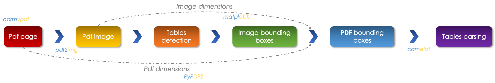
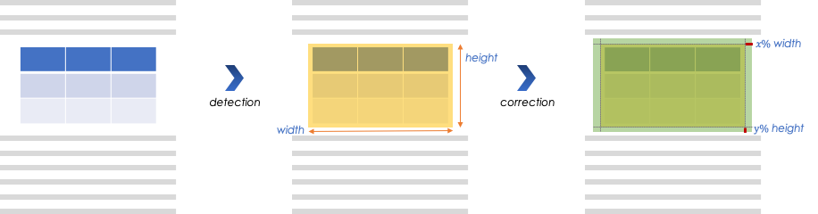
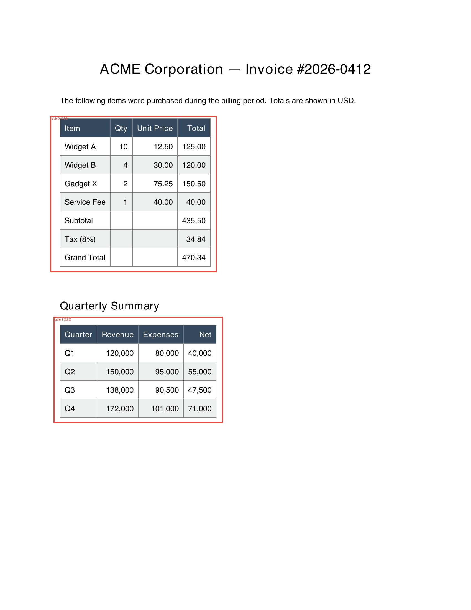
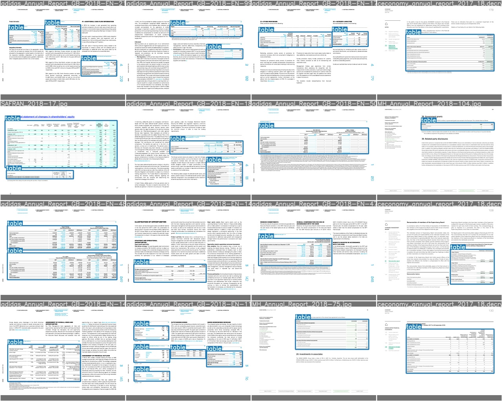

# PDF Table Extractor (YOLOv3 + Camelot)

Automatically detect and extract tables from PDF documents. A fine-tuned
**YOLOv3** model locates table regions on a rendered page, and
[**Camelot**](https://camelot-py.readthedocs.io/) extracts the cell-level data
from those regions into pandas DataFrames / Excel files.

> Camelot parses tables very well *when told where they are* (via
> `table_areas="x1,y1,x2,y2"`). Locating the table automatically is the hard
> part — that's what the YOLOv3 detector solves here.

<center></center>

## How it works

For a given PDF page the pipeline:

1. **Renders** the page to an image (`pdf2image`). Image-only PDFs can be made
   text-based first with `ocrmypdf`.
2. **Detects** table bounding boxes with YOLOv3-tiny (single class: `table`).
3. **Maps** each box from image pixel space into PDF coordinate space,
   expanding it slightly so the whole table is enclosed.

   <center></center>

4. **Extracts** each region with Camelot and returns one DataFrame per table.

The detector was fine-tuned on table annotations created with
[Makesense.ai](https://www.makesense.ai/) (YOLO export format) using a modified
[`ultralytics/yolov3`](https://github.com/ultralytics/yolov3) training setup.

## Project layout

```
.
├── pdf_table_extractor/        # Application package
│   ├── config.py               # YoloConfig dataclass (paths, thresholds)
│   ├── geometry.py             # Pure coordinate-mapping logic (fully unit-tested)
│   ├── detector.py             # TableDetector — wraps the YOLO engine
│   ├── pipeline.py             # extract_tables(): render → detect → map → Camelot
│   ├── api.py                  # FastAPI app (HTTP interface)
│   ├── cli.py                  # Command-line interface
│   └── yolo/                   # Vendored YOLOv3 engine (third-party, untouched)
├── assets/                     # Model weights, cfg and class names
├── tests/                      # pytest suite (geometry, pipeline, API)
├── pyproject.toml              # Packaging + black/ruff/pytest config
├── requirements*.txt           # Runtime / dev dependencies
├── Dockerfile · Makefile
```

The `pdf_table_extractor/yolo/` package is vendored third-party model code and
is intentionally excluded from formatting/linting.

## Installation

System dependencies: **Ghostscript** (Camelot) and **Poppler** (`pdf2image`).

```bash
# macOS
brew install ghostscript poppler

# Debian/Ubuntu
sudo apt-get install ghostscript poppler-utils
```

Python:

```bash
pip install -r requirements.txt
# or, as an installable package with the console script:
pip install .
```

## Usage

### Python

```python
from pdf_table_extractor import extract_tables

result = extract_tables("doc.pdf", page=2)
print(result.num_tables)
for df in result.tables:        # list of pandas DataFrames
    print(df)
result.save_excel("out/")       # one .xlsx per table
```

### Command line

```bash
pdf-table-extractor --pdf-path doc.pdf --page 2 --out-dir out/
# equivalently:
python -m pdf_table_extractor.cli --pdf-path doc.pdf --page 2
```

### HTTP API

```bash
pip install -r requirements.txt          # includes FastAPI + uvicorn
uvicorn pdf_table_extractor.api:app --reload
```

| Method | Path             | Description                              |
|--------|------------------|------------------------------------------|
| GET    | `/health`        | Liveness probe                           |
| POST   | `/extract?page=N`| Upload a PDF, returns detected tables JSON |

```bash
curl -F "file=@doc.pdf" "http://localhost:8000/extract?page=2"
```

Interactive docs are served at `http://localhost:8000/docs`.

### Docker

```bash
docker build -t pdf-table-extractor .
docker run -p 8000:8000 pdf-table-extractor
```

## Development

```bash
pip install -r requirements-dev.txt

make format    # black
make lint      # ruff + black --check
make test      # pytest
```

The test suite mocks the heavy boundaries (torch / Camelot / pdf2image), so it
runs fast and without GPU or those optional dependencies installed. The pure
coordinate math in `geometry.py` is tested against known numeric values.

## Examples

A runnable, end-to-end demo lives in [`examples/`](examples/): it generates a
sample invoice PDF, runs the pipeline and saves the detected-box overlay plus the
extracted tables (`.xlsx`/`.csv`/`.json`). See [examples/README.md](examples/README.md).

```bash
python examples/run_pipeline.py
```



<center></center>

> **NB:** following the same steps, the detector can be trained to find *any*
> object on a PDF page (figures, charts, signatures, …) and extract it.

## License

MIT.
